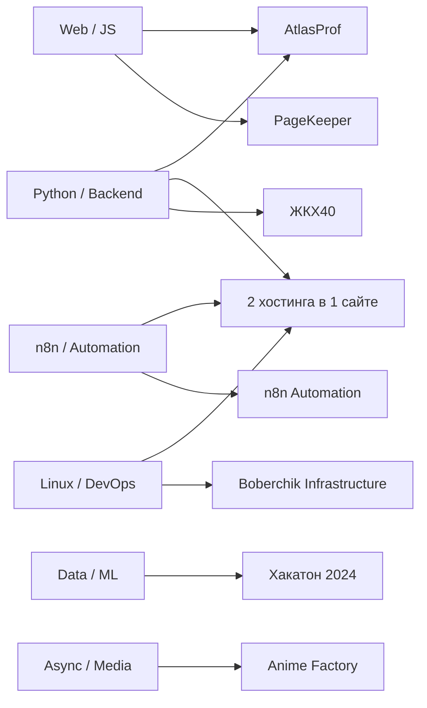

# Engineering Portfolio

Портфолио реальных, командных и хакатонных проектов: веб-системы, Python/ML, автоматизация и Linux-инфраструктура.

Главная страница — это краткая витрина. По названию проекта или ссылке **«Кейс»** открывается подробное описание со схемами, структурой и техническими решениями; по ссылке **«Код / примеры»** — безопасные публичные примеры и структура исходного проекта.

> Часть production-репозиториев приватная или командная. Я не публикую секреты, рабочие конфиги и чужую Git-историю. Папки `examples/` содержат специально очищенные portfolio-примеры, а не выдаются за полный production source.

## Карта портфолио

## Основные проекты

| # | Проект | Что это | Материалы |
|---:|---|---|---|
| 1 | [**AtlasProf — Атлас профессий**](docs/atlasprof.md) | Командная веб-система: карта направлений, профессии, образовательные траектории, база знаний и админка | [Кейс](docs/atlasprof.md) · [Код / примеры](examples/atlasprof/) |
| 2 | [**2 хостинга в 1 сайте**](docs/unified-vps-panel.md) | Единый сайт и веб-панель для двух VPS-провайдеров: статусы, пользователи, конфигурации, сервисы и автоматизация | [Кейс](docs/unified-vps-panel.md) · [Код / примеры](examples/unified-vps-panel/) |
| 3 | [**n8n Automation**](docs/n8n-automation.md) | Orchestration и автоматизация вокруг Python-сервисов, API, событий и серверной инфраструктуры | [Кейс](docs/n8n-automation.md) · [Workflow / код](examples/n8n-automation/) |
| 4 | [**ЖКХ40**](docs/zhkh40.md) | Командный Flask-сервис: база знаний, чат-сценарии, документы, калькуляторы и админка | [Кейс](docs/zhkh40.md) · [Код / примеры](examples/zhkh40/) |
| 5 | [**Хакатон 2024 — ML и геоданные**](docs/hakaton-2024.md) | ML-классификация ошибок, Excel-processing, геокодирование и интерактивная карта | [Кейс](docs/hakaton-2024.md) · [ML / примеры](examples/hakaton-2024/) |

## Другие технические проекты

| Проект | Что это | Материалы |
|---|---|---|
| [**PageKeeper**](docs/pagekeeper.md) | Браузерное расширение для сохранения сложных веб-страниц в PDF и редактируемый Word | [Кейс](docs/pagekeeper.md) · [Код / примеры](examples/pagekeeper/) |
| [**Boberchik Infrastructure**](docs/boberchik-infrastructure.md) | Linux/nginx/systemd, deployment, backup/recovery и автоматические проверки | [Кейс](docs/boberchik-infrastructure.md) · [Код / примеры](examples/boberchik-infrastructure/) |
| [**Anime Factory**](docs/anime-factory.md) | Pipeline анализа, рендера и публикации коротких видео | [Кейс](docs/anime-factory.md) · [Код / примеры](examples/anime-factory/) |

## Публичные репозитории с полным кодом

- [**vacancy-tracker-api**](https://github.com/AndrMiAl/vacancy-tracker-api) — FastAPI, SQLite, Pytest, Docker, CI;
- [**gos-exam-trainer**](https://github.com/AndrMiAl/gos-exam-trainer) — Vue 3, TypeScript, Node.js, тесты и CI;
- [**ml-neural-networks-labs**](https://github.com/AndrMiAl/ml-neural-networks-labs) — Jupyter Notebook по ML и нейронным сетям;
- [**kotlin-practice**](https://github.com/AndrMiAl/kotlin-practice) — алгоритмы, коллекции, функции высшего порядка и ООП.

## Основной стек

**Python · Backend · Flask/FastAPI · Data/ML · scikit-learn · TensorFlow · n8n · Automation · Linux · nginx · Docker · JavaScript**

## Как читать это портфолио

На каждой странице проекта есть:

1. краткая задача и контекст;
2. архитектурная схема;
3. схема основного сценария;
4. структура реального исходного проекта без секретов;
5. ссылки на безопасные примеры кода;
6. технические решения и ограничения;
7. пояснение, что публично, а что остаётся приватным/командным.
