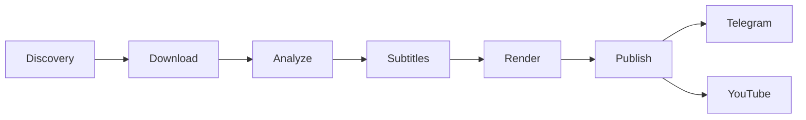
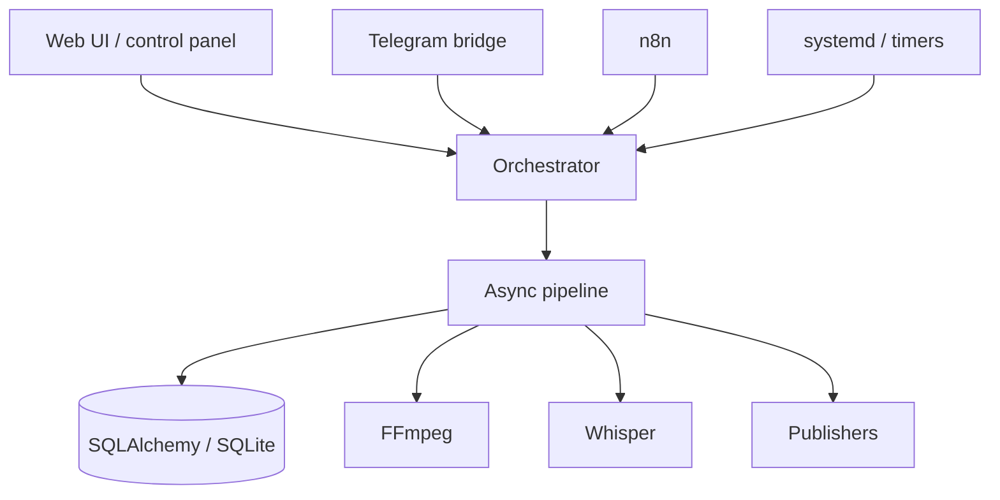

# Anime Factory

[← Все проекты](../README.md) · [Код / примеры](../examples/anime-factory/)

**Тип:** рабочий приватный pipeline
**Стек:** Python · asyncio · SQLAlchemy · FFmpeg · faster-whisper · YouTube API · Telegram · n8n

## Задача

Автоматизировать путь от исходного материала до готового короткого видео и его публикации, сохраняя отдельные этапы заменяемыми и управляемыми.

## Pipeline



## Архитектура компонентов



## Реальная структура проекта

```text
core/
├── anime_shorts/
│   ├── orchestrator.py
│   ├── pipeline.py
│   ├── repositories.py
│   ├── models.py
│   ├── discovery/
│   ├── downloaders/
│   ├── editors/
│   ├── publishers/
│   └── subtitles/
├── tests/
└── pyproject.toml
n8n/
├── config/
└── scripts/
deploy/systemd/
telegram/
web-ui/
youtube/
```

## Код / примеры

- [Async pipeline](../examples/anime-factory/pipeline.py)
- [Папка примеров](../examples/anime-factory/)

## Инженерные задачи

Здесь ценна связка компонентов: stateful pipeline, внешние процессы, media processing, OAuth/API-интеграции, фоновые сервисы и повторяемость запуска. Компоненты разделены через stages/protocols, поэтому отдельные реализации можно менять без переписывания всего pipeline.

## Проверки

В приватной кодовой базе есть тесты для captions, clip collection, control panel, decorators, inbox/matching и YouTube publisher. Python-код проходит compile/syntax checks.

## Безопасность

Media, cookies, OAuth credentials, Telegram/YouTube tokens, рабочая база и runtime-логи не публикуются. Production repository остаётся приватным.
