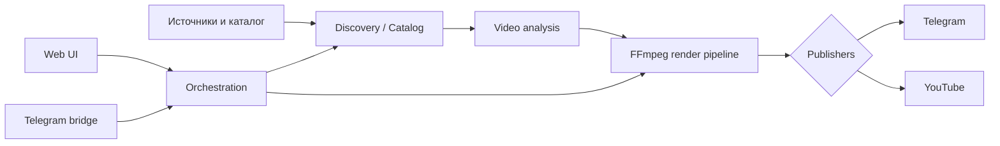

# Anime Factory

**Тип:** рабочий приватный проект
**Задача:** автоматизировать путь от исходного материала до готового короткого видео и его публикации.

## Что реализовано

Проект объединяет несколько сервисов в единый pipeline:

1. получение каталога и метаданных;
2. поиск/получение исходного материала;
3. анализ видео и выбор подходящих фрагментов;
4. рендер вертикального ролика;
5. субтитры, overlay и watermark;
6. публикация в Telegram и YouTube;
7. управление через Telegram и Web UI;
8. запуск фоновых компонентов как Linux-сервисов.

## Архитектура

## Стек

- **Python / asyncio** — основная backend-логика;
- **SQLAlchemy + SQLite** — каталог, состояние и история публикаций;
- **FFmpeg / ffmpeg-python** — обработка и рендер видео;
- **faster-whisper** — работа с речью/субтитрами;
- **yt-dlp** — получение доступного исходного материала;
- **YouTube Data API** — публикация;
- **aiogram / Telegram** — управление и уведомления;
- **Linux, systemd, supervisor** — эксплуатация сервисов.

## Инженерные задачи

Проект ценен не отдельным алгоритмом, а связкой компонентов: нужно синхронизировать состояние pipeline, не смешивать runtime с исходниками, безопасно работать с OAuth/token-based интеграциями и сохранять управляемость системы после переноса на сервер.

В кодовой базе есть отдельные тесты для captions, clip collection, control panel, decorators, inbox/matching и YouTube publisher. Python-модули дополнительно проходят syntax/compile проверки перед изменениями.

## Безопасность

Рабочие базы, media, cookies, OAuth credentials, Telegram/YouTube tokens, ключи и логи не хранятся в публичном Git. Для конфигурации используются только безопасные шаблоны.

**Исходный production-репозиторий остаётся приватным.**
