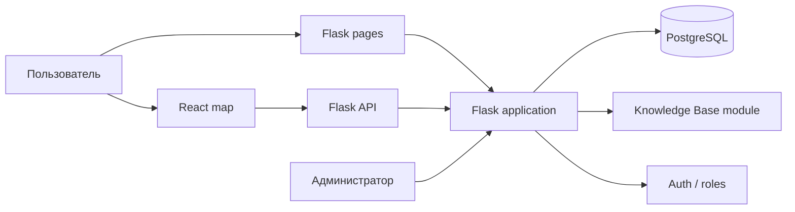
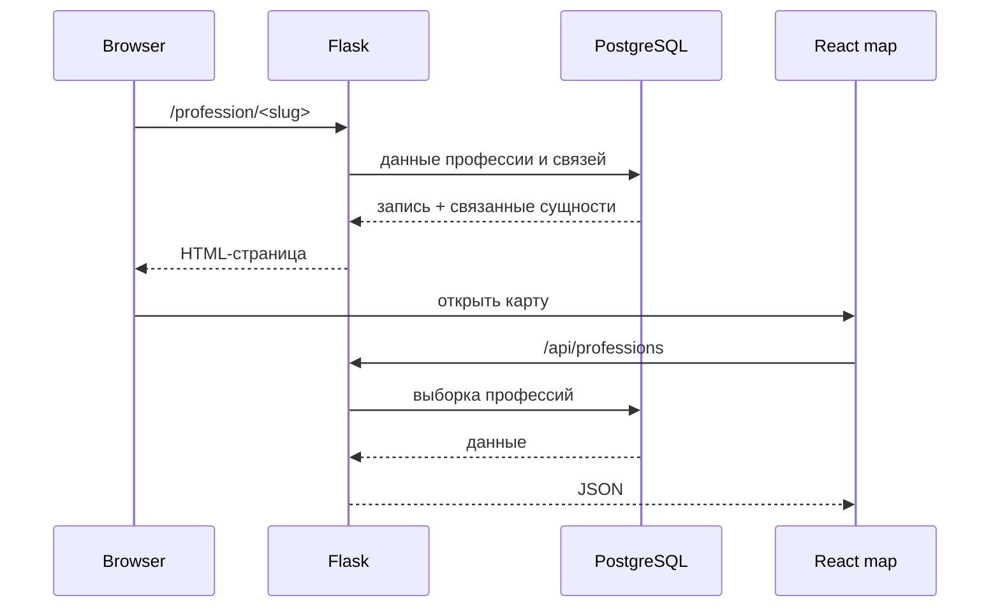

# AtlasProf — Атлас профессий

[← Все проекты](../README.md) · [Код / примеры](../examples/atlasprof/)

**Тип:** командный веб-проект
**Стек:** Python · Flask · PostgreSQL · React · JavaScript · HTML/CSS

## Коротко

AtlasProf объединяет карту направлений, страницы подразделений и профессий, образовательные траектории, базу знаний и административную часть. Это не одна страница, а система с несколькими пользовательскими и административными сценариями.

## Что есть в системе

- карта и навигация по направлениям;
- страницы подразделений и профессий;
- карьерные и образовательные траектории;
- база знаний с категориями, поиском и вложениями;
- роли пользователей и административные интерфейсы;
- работа с изображениями, видео и документами;
- React-сборка для интерактивной карты;
- Flask API для данных карты и профессий.

## Архитектура



## Как проходит запрос



## Структура исходного проекта

```text
atlas/
├── app.py
├── auth.py
├── db.py
├── db_admin_users.py
├── templates/
│   ├── profession.html
│   ├── department.html
│   └── admin_*.html
├── static/
│   ├── js/
│   └── styles/
├── wiki/
│   ├── kb_app.py
│   ├── kb_db.py
│   └── templates/kb/
└── react_frontend/build/

my-app/
├── src/App.js
├── src/RotateOverlay.jsx
└── src/assets/
```

## Код / примеры

Публично вынесены небольшие очищенные примеры, чтобы можно было посмотреть подход без публикации командного репозитория:

- [Flask routes и JSON API](../examples/atlasprof/flask_routes.py)
- [Поиск по базе знаний](../examples/atlasprof/knowledge_search.py)
- [Папка примеров](../examples/atlasprof/)

## Технические моменты

Flask обслуживает серверные страницы, API и административные сценарии. Интерактивная карта вынесена в React-сборку, а база знаний существует как отдельный модуль. Такое разделение позволяет не переписывать весь проект под SPA и при этом использовать React там, где интерактивность действительно нужна.

## Публичность и командная история

Исходная история проекта командная. В портфолио я не копирую чужие коммиты и не выдаю весь командный репозиторий за личный. Здесь показаны архитектура, фактическая структура проекта и безопасные примеры для технического просмотра.
