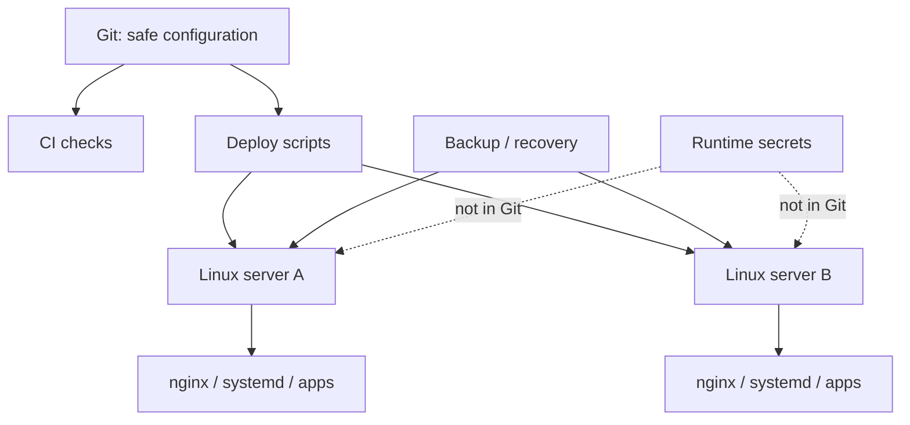
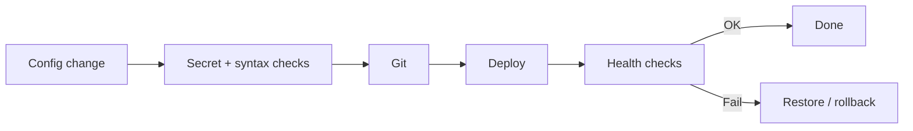

# Boberchik Infrastructure

[← Все проекты](../README.md) · [Код / примеры](../examples/boberchik-infrastructure/)

**Тип:** рабочая инфраструктура нескольких Linux-серверов
**Стек:** Linux · nginx · systemd · Bash · Python · GitHub Actions

## Задача

Хранить воспроизводимую часть серверной конфигурации отдельно от живого runtime-состояния и секретов, чтобы сервисы можно было проверять, переносить и восстанавливать.

## Что входит

- nginx-конфигурация;
- systemd services и timers;
- SSH-hardening, fail2ban и sysctl;
- deployment/configuration scripts;
- Python/Bash служебные утилиты;
- инвентаризация сервисов;
- backup/recovery;
- CI и secret scan.

## Архитектура



## Цикл изменения



## Пример структуры

```text
.github/workflows/ci.yml
3x-ui/
├── README.md
├── install-vdsina.sh
└── provision-reality.py
apps/
├── boberchik-cloud/
├── boberchik-vpn/
├── mcp-gateway/
└── traffic-dashboard/
scripts/
└── secret-scan.sh
```

## Код / примеры

- [Health check script](../examples/boberchik-infrastructure/healthcheck.sh)
- [systemd service example](../examples/boberchik-infrastructure/example.service)
- [Папка примеров](../examples/boberchik-infrastructure/)

## Проверки

CI выполняет secret scan, shell syntax validation и Python compile checks. Scanner блокирует реальные `.env` и token-like значения, но допускает безопасные шаблоны `.env.example`.

## Что не хранится в Git

Рабочие базы, токены, ключи, client identifiers, cookies, sessions, certificates, логи и backup-архивы остаются вне публичного Git.

Production infrastructure repository остаётся приватным.
