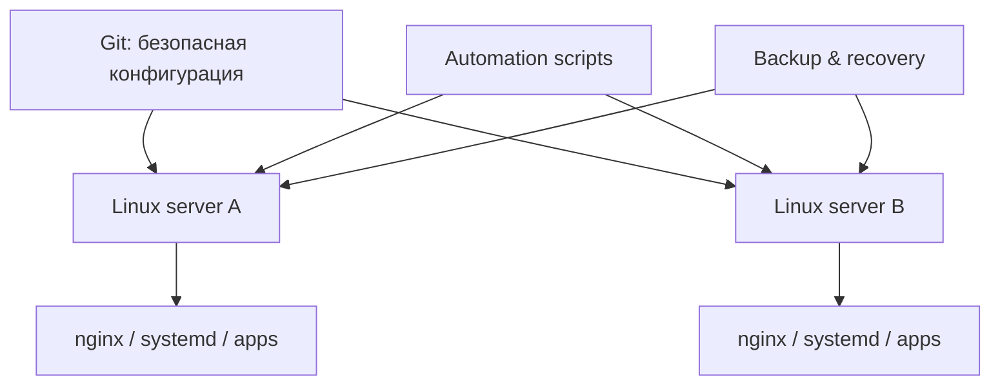

# Boberchik Infrastructure

**Тип:** рабочая инфраструктура нескольких Linux-серверов
**Задача:** хранить воспроизводимую и безопасную часть серверной конфигурации отдельно от живого runtime-состояния.

## Что входит в проект

- nginx-конфигурация;
- systemd services и timers;
- SSH-hardening, fail2ban и sysctl;
- deployment/configuration scripts;
- серверные приложения и служебные Python/Bash-утилиты;
- инвентаризация сервисов;
- backup/recovery scripts;
- автоматические проверки репозитория.

## Архитектурный принцип

Git хранит **описание того, как система должна быть устроена**, но не рабочие секреты и не текущее состояние сервисов.

## Проверки

CI выполняет несколько практических проверок:

- secret scan;
- shell syntax validation;
- Python compile checks.

Отдельный secret scanner блокирует реальные `.env` и token-like значения, но допускает безопасные шаблоны типа `.env.example`.

## Что намеренно исключено из Git

- рабочие базы данных;
- пароли и API/OAuth tokens;
- приватные SSH/TLS ключи;
- клиентские UUID и другие идентификаторы доступа;
- certificates, cookies, sessions;
- логи, backup-архивы и временные runtime-данные.

## Что показывает этот проект

Это не «папка с конфигами», а практика эксплуатации: воспроизводимость, раздельное хранение secrets/runtime, автоматические проверки и возможность восстановить сервисы после переноса или сбоя.

**Рабочий инфраструктурный репозиторий остаётся приватным.**
