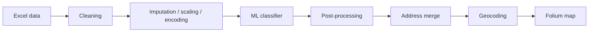
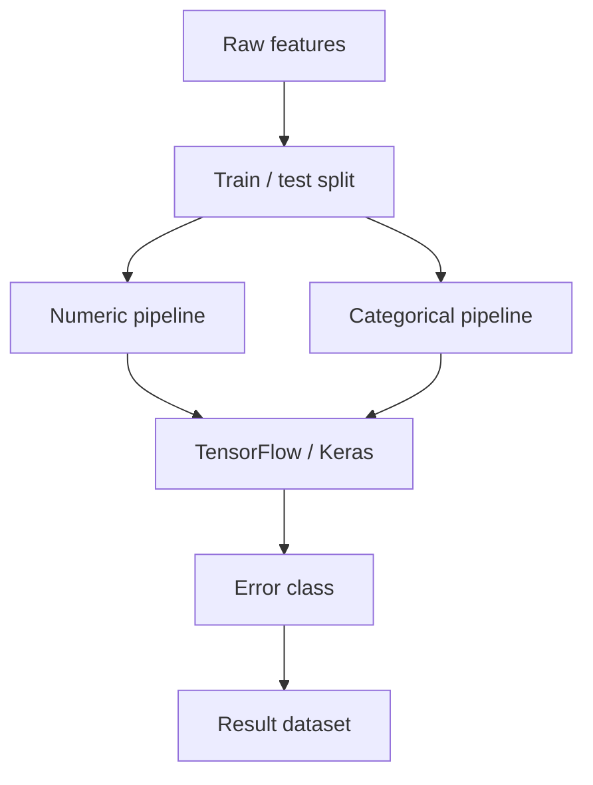

# Хакатон 2024 — ML и геоданные

[← Все проекты](../README.md) · [ML / примеры](../examples/hakaton-2024/)

**Тип:** командный хакатонный проект
**Стек:** Python · Pandas · NumPy · scikit-learn · TensorFlow/Keras · Folium · geocoding

## Задача

Проект обрабатывал данные теплоснабжения и адресные наборы: нужно было подготовить табличные данные, классифицировать возможные ошибки, объединить результаты с адресами и визуализировать объекты на карте.

## Полный pipeline



## ML-часть



## Структура исходного решения

```text
Neural_network.py
Post_processing.py
geocoder.py
map_generator.py
cleaned_excel_file.xlsx
map.html
Крутые бобры.pptx
```

Реальный код разделён на модель, post-processing, геокодирование и генерацию карты.

## Код / примеры

- [ML pipeline](../examples/hakaton-2024/ml_pipeline.py)
- [Map pipeline](../examples/hakaton-2024/map_pipeline.py)
- [Папка примеров](../examples/hakaton-2024/)

## Что показывает проект

Здесь важна связка нескольких этапов, а не только обучение модели: табличные данные нужно привести к пригодному виду, получить предсказание, связать результат с адресами и сделать его визуально проверяемым на карте.

## Командный проект

В публичном портфолио решение показано как case study. Исходная командная Git-история не переносится в личный профиль.
