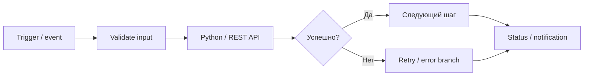
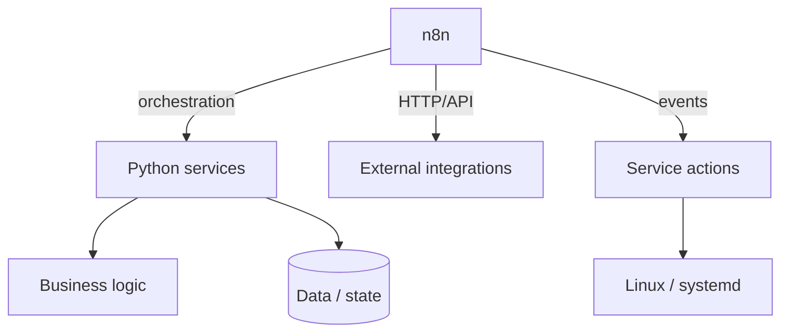

# n8n Automation

[← Все проекты](../README.md) · [Workflow / код](../examples/n8n-automation/)

**Тип:** production-автоматизация вокруг Python-сервисов и серверных процессов
**Стек:** n8n · Python · REST/API · Linux · systemd

## Коротко

n8n используется как orchestration-слой: принимает событие, связывает API и Python-компоненты, принимает решение по результату шага и передаёт выполнение дальше. Основная бизнес-логика при этом остаётся в коде.

## Типовой workflow



## Разделение ответственности



## Где это применяется

- последовательные workflow вокруг Python-сервисов;
- API-вызовы и проверка результата;
- повторяемые серверные операции;
- условные ветки и retry-сценарии;
- фоновые цепочки обработки;
- отчёт о результате и переход к следующему этапу.

## Почему не переносить всю логику в low-code

n8n удобен для orchestration, но сложная обработка, работа с данными и тестируемая бизнес-логика остаются в Python. В результате workflow остаётся читаемым, а код — проверяемым и переносимым.

## Workflow / код

- [Очищенный n8n workflow](../examples/n8n-automation/workflow.example.json)
- [Python worker для одного шага](../examples/n8n-automation/worker.py)
- [Папка примеров](../examples/n8n-automation/)

```text
examples/n8n-automation/
├── workflow.example.json
├── worker.py
└── README.md
```

## Production-эксплуатация

n8n и связанные Python-компоненты запускаются как отдельные сервисы. Это позволяет рестартовать orchestration независимо от основной логики и не хранить реальные credentials внутри экспортируемого workflow.

## Безопасность

Публичный workflow не содержит credential IDs, токенов, внутренних URL и реальных endpoint-адресов. Это именно технический пример структуры workflow.
