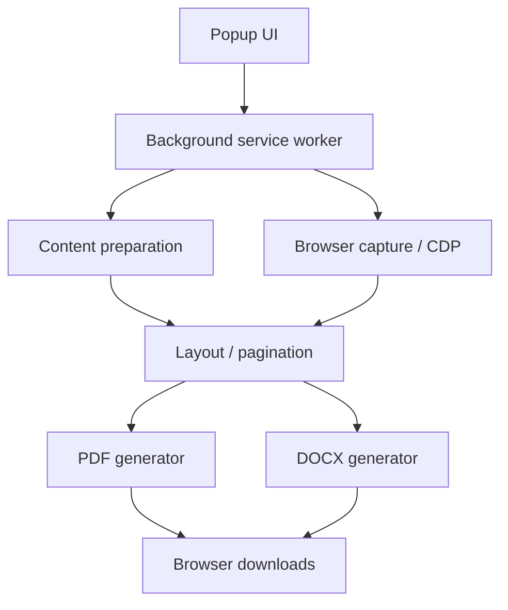
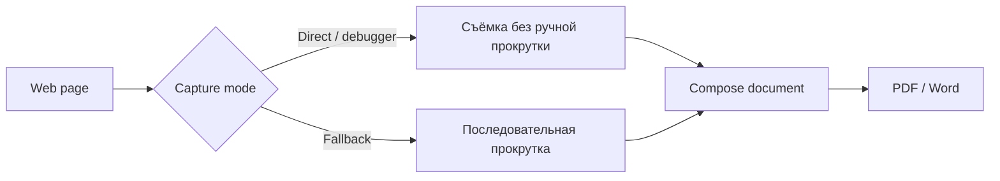

# PageKeeper

[← Все проекты](../README.md) · [Код / примеры](../examples/pagekeeper/)

**Тип:** рабочее браузерное расширение
**Версия исходников:** 1.19.0
**Стек:** JavaScript · Chrome Manifest V3 · browser APIs · PDF/DOCX generation

## Задача

Сохранять веб-страницы в PDF и Word так, чтобы результат был пригодным документом: PDF — с настоящим текстовым слоем, Word — редактируемый и структурированный.

## Что умеет

### PDF
- настоящий текстовый слой;
- поиск и копирование текста;
- сохранение визуального оформления.

### Word
- редактируемый документ;
- заголовки, таблицы, изображения и ссылки;
- режимы от точного отображения до более чистой структуры.

## Архитектура расширения



## Два режима захвата



## Реальная структура проекта

```text
src/
├── background/
│   ├── cdp.js
│   └── worker.js
├── content/
│   └── prepare.js
├── core/
│   ├── breaks.js
│   ├── docx.js
│   ├── filename.js
│   ├── pdf.js
│   └── plan.js
└── ui/
    ├── popup.html
    ├── popup.css
    └── popup.js
```

## Код / примеры

- [Capture orchestration](../examples/pagekeeper/capture_flow.js)
- [Pagination example](../examples/pagekeeper/pagination.js)
- [Папка примеров](../examples/pagekeeper/)

## Сложная часть задачи

Длинные чаты и виртуализированные ленты часто держат в DOM только видимую область. Поэтому «снять всю страницу» недостаточно: нужно управлять сбором содержимого, разбиением на листы и fallback-сценариями.

## Качество

Для версии 1.19.0 зафиксированы **42 сценария проверки**. CI проверяет manifest, Manifest V3, синхронность номера версии и синтаксис JavaScript.

## Приватность

Содержимое обрабатывается локально в браузере. Production source пока остаётся приватным, поэтому в portfolio-репозитории опубликованы только безопасные примеры.
