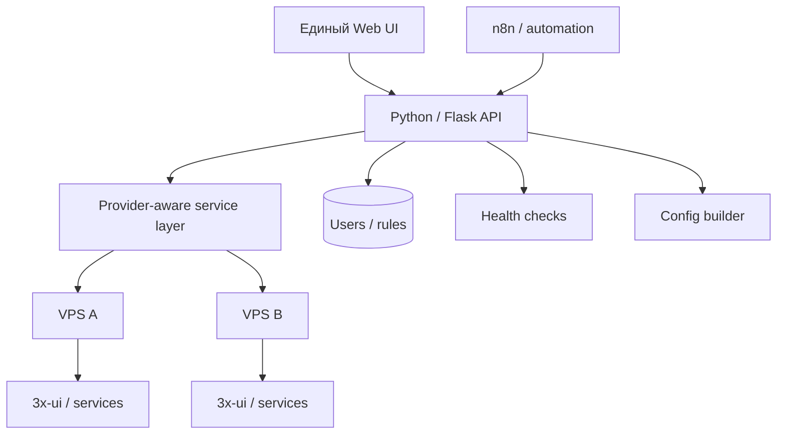
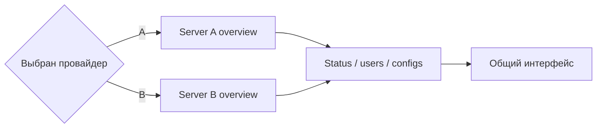

# 2 хостинга в 1 сайте

[← Все проекты](../README.md) · [Код / примеры](../examples/unified-vps-panel/)

**Тип:** рабочий сайт и веб-панель для двух VPS-площадок
**Стек:** Python · Flask · JavaScript · n8n · Linux · nginx · systemd · 3x-ui/Xray

## Задача

Вместо двух разрозненных панелей и набора ручных команд нужен один интерфейс, в котором видно обе серверные площадки, состояние сервисов и пользовательские конфигурации. Важное условие — данные двух провайдеров не должны смешиваться.

## Что реализовано

- единый UI с переключением провайдера;
- overview по двум серверам;
- health/status checks;
- работа с пользователями;
- отдельные действия и конфигурации для каждой площадки;
- клиентский кабинет и устройства;
- выдача готовых конфигураций;
- резервное копирование перед изменениями;
- интеграция с Linux/nginx/systemd;
- automation/workflow слой для повторяемых действий.

## Архитектура



## Один экран — два провайдера



## Реальная структура приватного проекта

```text
apps/boberchik-vpn/
├── vpn_admin.py
├── vpn_cabinet_ext.py
├── full_template.py
├── vpn-admin.html
└── vpn-cabinet.html
```

В backend есть отдельные endpoint-группы для overview/status, пользователей, правил, кабинета, устройств и генерации конфигураций.

## Код / примеры

- [Provider adapter](../examples/unified-vps-panel/provider_adapter.py)
- [Aggregated health endpoint](../examples/unified-vps-panel/health_api.py)
- [Папка примеров](../examples/unified-vps-panel/)

Примеры намеренно очищены от адресов серверов, UUID, ключей и любых реальных подписок.

## Что здесь важно инженерно

Главная часть задачи — не сам UI, а нормализация двух разных runtime-контекстов в один API. Внешнему интерфейсу не нужно знать детали каждой площадки: он получает одинаковую модель состояния, а provider-specific логика остаётся в backend.

## Безопасность

В публичный Git не выносятся реальные адреса, секреты, client UUID, приватные ключи и рабочие конфигурации. Production source остаётся приватным.
