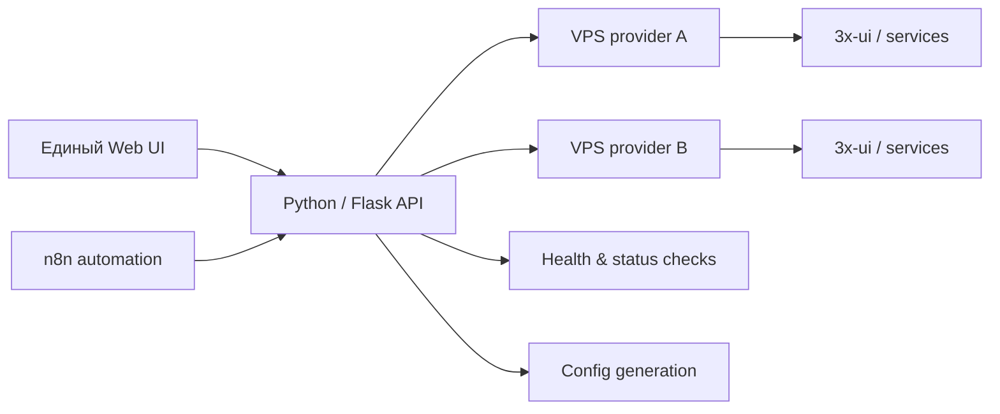

# 2 хостинга в 1 сайте

**Тип:** рабочий сайт и веб-панель для управления сервисами на двух VPS-провайдерах.

Цель проекта — не держать две разрозненные панели и набор ручных команд, а видеть обе серверные площадки из одного интерфейса и переключаться между ними без смены рабочего контекста. Для повторяемых действий и связки сервисов используется n8n как слой автоматизации и orchestration.

## Что реализовано

- переключение между двумя VPS-провайдерами в одном UI;
- отдельное состояние и конфигурация каждого сервера;
- health/status проверки;
- отображение состояния управляющего канала и 3x-ui;
- список пользователей и активных inbound-конфигураций;
- операции управления пользователями там, где это поддерживается;
- генерация и выдача готовых клиентских конфигураций;
- provider-specific действия без смешивания данных двух серверов;
- n8n-workflow для автоматизации повторяемых операций и связки сервисов;
- интеграция с общей Linux/nginx/systemd-инфраструктурой.

## Архитектура

## Стек

**Python · Flask · n8n · JavaScript · Linux · nginx · systemd · 3x-ui/Xray · REST/API**

В публичное описание не выносятся адреса серверов, UUID, ключи, подписки и другая рабочая конфигурация.
