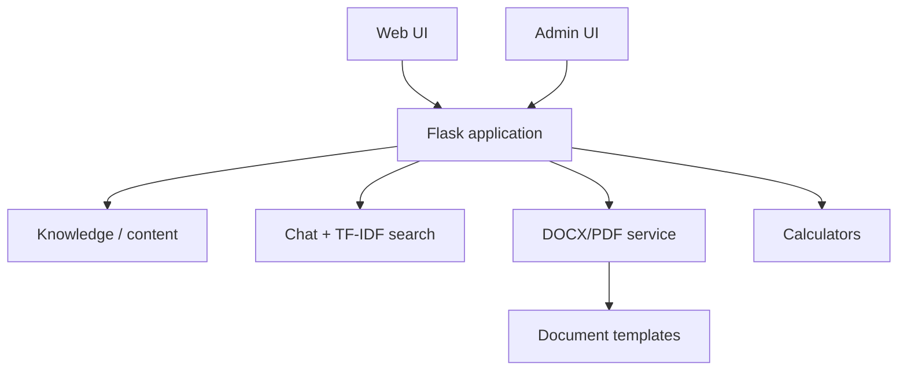
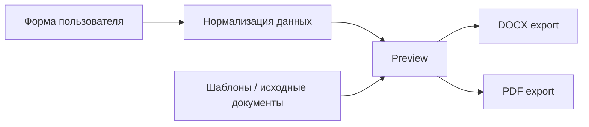

# ЖКХ40

[← Все проекты](../README.md) · [Код / примеры](../examples/zhkh40/)

**Тип:** командный рабочий Flask-проект
**Стек:** Python · Flask · JavaScript · HTML/CSS · DOCX/PDF · TF-IDF

## Коротко

ЖКХ40 — веб-сервис по вопросам ЖКХ: база знаний, чат-сценарии, поиск, калькуляторы, шаблоны документов и административная часть.

## Возможности

- база знаний по вопросам ЖКХ;
- чат-сценарии и подбор релевантных ответов;
- калькуляторы;
- просмотр DOCX прямо в интерфейсе;
- формы для подготовки заявлений;
- экспорт DOCX и PDF;
- поиск по материалам;
- административная панель;
- управление контентом и документами.

## Архитектура



## Поток работы с документом



## Мой подтверждённый вклад по истории проекта

- развитие административной панели;
- доработка главной страницы, страницы «О нас» и чата;
- просмотр Word-документов;
- доработка DOCX preview;
- правки интерфейса и CSS;
- подключение шрифтов для формирования документов.

## Структура проекта

```text
app.py
site_data.py
templates/
├── admin_dashboard.html
├── chat.html
├── calculator.html
├── document_fill.html
├── document_preview.html
└── docx_preview.html
static/
├── docs/
├── fonts/
├── img/
├── css/
└── js/
```

В `app.py` находятся отдельные блоки для DOCX parsing/preview, TF-IDF поиска, чат-сценариев, генерации документов и admin routes.

## Код / примеры

- [Поиск по базе знаний](../examples/zhkh40/search_service.py)
- [Подготовка документа](../examples/zhkh40/document_service.py)
- [Папка примеров](../examples/zhkh40/)

## Почему case study

Исходный репозиторий командный. В портфолио остаются подтверждённый вклад, архитектура и безопасные примеры — без копирования чужой Git-истории.
